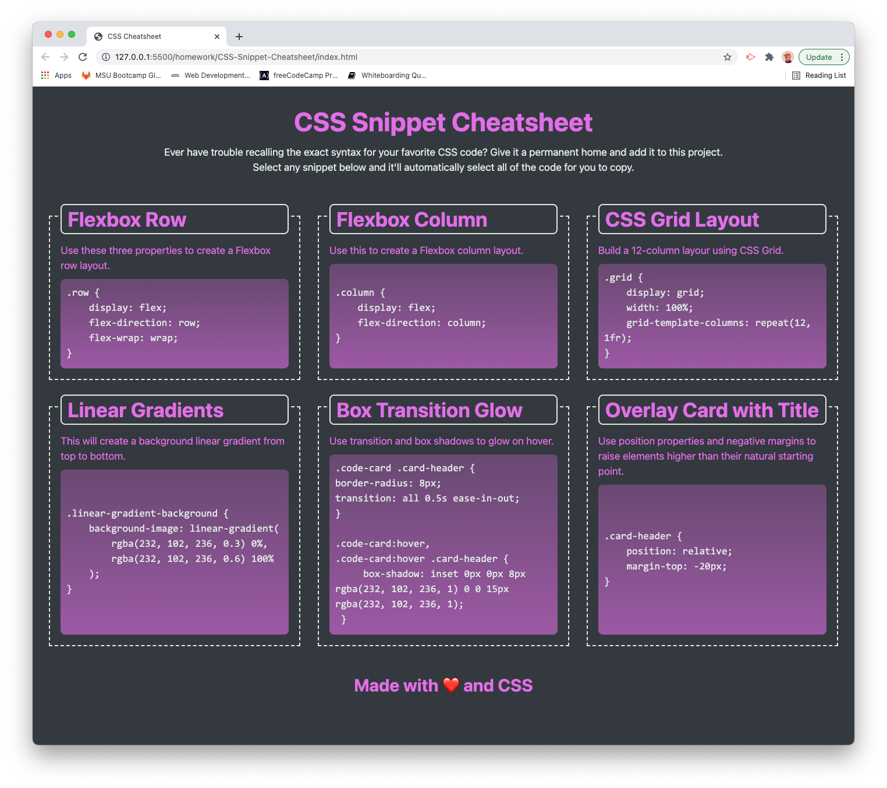
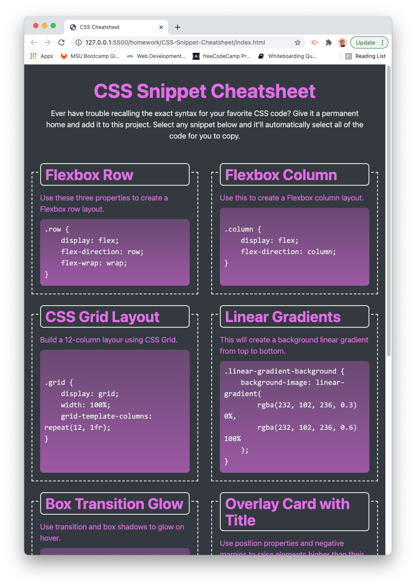
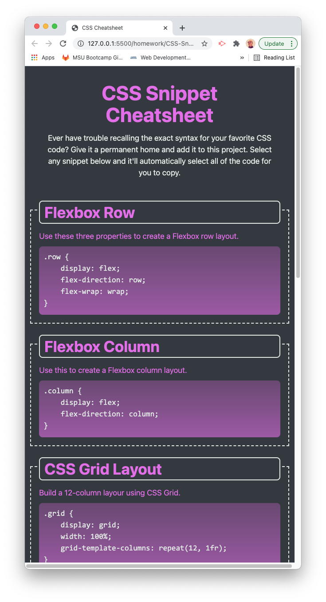

# CSS-Snippet-Cheatsheet

# <Your-Project-Title>
## Description
This project was completed to explore the use of CSS's powerfu flexbox utilities.

## Table of Contents (Optional)
If your README is long, add a table of contents to make it easy for users to find what they need.
- [Installation](#installation)
- [Usage](#usage)
- [Credits](#credits)
- [License](#license)
## Installation
This webpage does not rely on any other files or resources other than provided in this repository.
## Usage

The website is setup to be responsive to device size.  If the user is on a computer or other device with a screen width of 992 pixels or greater, they will see three snippets on a row.

If the user is on a tablet or other device with a screen width smaller than 992 pixels but at least 768 pixels wide, they will see two snippets per row.

Finally, if the user is on a phone or other device with a screen width smaller than 768 pixels wide, they will see one snippet per row.

The snippets are setup so that when the user clicks on one, the text is selected and ready to be copied and then pasted into their own CSS code.

## Credits
This project was part of one of the in-class projects for the MSU Full Stack Developer Boot Camp.  I have updated my files to reflect the solution provided by the  instructor, Ross Ritchey.

README.md format courtesy of https://coding-boot-camp.github.io/full-stack/github/professional-readme-guide

## License
MIT License

Copyright (c) [2021] [Barry St. Pierre]

Permission is hereby granted, free of charge, to any person obtaining a copy of this software and associated documentation files (the "Software"), to deal in the Software without restriction, including without limitation the rights to use, copy, modify, merge, publish, distribute, sublicense, and/or sell copies of the Software, and to permit persons to whom the Software is furnished to do so, subject to the following conditions:

The above copyright notice and this permission notice shall be included in all copies or substantial portions of the Software.

THE SOFTWARE IS PROVIDED "AS IS", WITHOUT WARRANTY OF ANY KIND, EXPRESS OR IMPLIED, INCLUDING BUT NOT LIMITED TO THE WARRANTIES OF MERCHANTABILITY, FITNESS FOR A PARTICULAR PURPOSE AND NONINFRINGEMENT. IN NO EVENT SHALL THE AUTHORS OR COPYRIGHT HOLDERS BE LIABLE FOR ANY CLAIM, DAMAGES OR OTHER LIABILITY, WHETHER IN AN ACTION OF CONTRACT, TORT OR OTHERWISE, ARISING FROM, OUT OF OR IN CONNECTION WITH THE SOFTWARE OR THE USE OR OTHER DEALINGS IN THE SOFTWARE.

